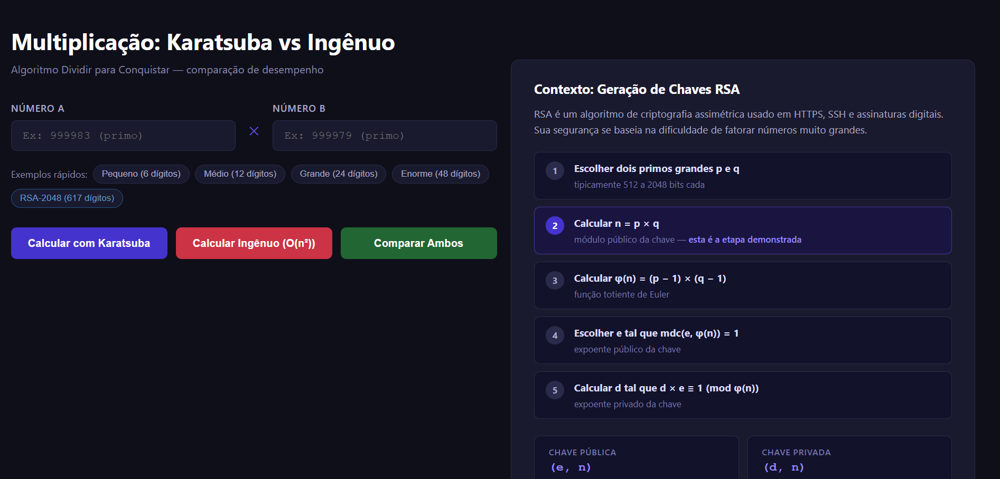
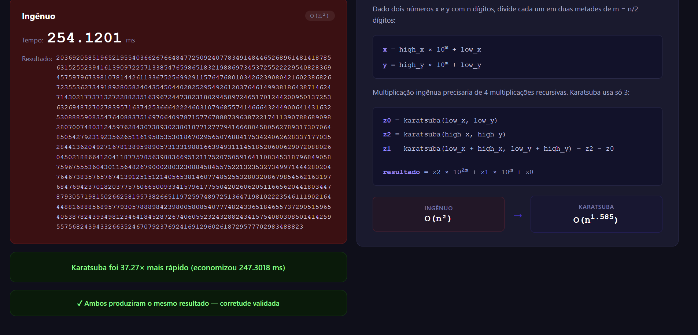
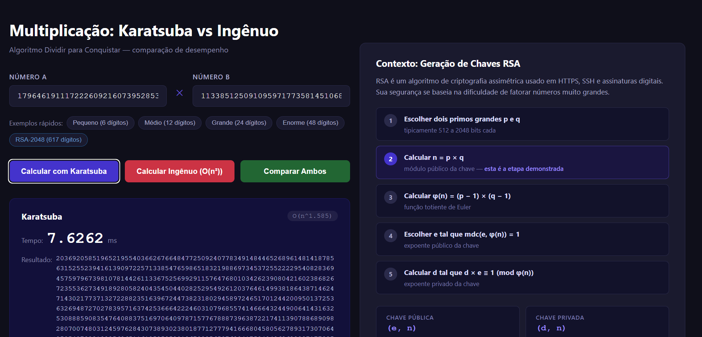

# D&C_Karatsuba-RSA

Número da Lista: **48**<br>
Conteúdo da Disciplina: **D&C**<br>

## Alunos

| Matrícula  | Aluno                    |
| ---------- | ------------------------ |
| 23/1034082 | ARTUR HANDOW KRAUSPENHAR |
| 21/1031593 | ANDRE LOPES DE SOUSA     |

**Apresentação:** [Link para o vídeo](...)

## Sobre

Implementação do algoritmo de **Karatsuba** aplicado ao contexto de multiplicação de grandes números, motivado pela geração de chaves RSA (`n = p × q`).

O projeto compara o algoritmo de Karatsuba (O(n^1.585)) contra a multiplicação ingênua (O(n²)) em uma interface web interativa, permitindo visualizar a diferença de desempenho com números de tamanhos variados.

### Contexto: Geração de Chaves RSA

RSA é um algoritmo de criptografia assimétrica amplamente usado em HTTPS, SSH e assinaturas digitais. A segurança do RSA depende da dificuldade de fatorar números muito grandes.

A geração de uma chave RSA segue os seguintes passos:

1. Escolher dois números primos grandes **p** e **q** (tipicamente 512 a 2048 bits cada)
2. Calcular **n = p × q** — este é o módulo público da chave
3. Calcular **φ(n) = (p − 1) × (q − 1)**
4. Escolher **e** tal que `1 < e < φ(n)` e `mdc(e, φ(n)) = 1` (expoente público)
5. Calcular **d** tal que `d × e ≡ 1 (mod φ(n))` (expoente privado)

A **chave pública** é o par `(e, n)` e a **chave privada** é o par `(d, n)`.

O passo crítico de desempenho é a multiplicação `n = p × q`, pois **p** e **q** são números com centenas de dígitos. É exatamente nesse passo que o Karatsuba se aplica — reduzindo o custo da multiplicação de O(n²) para O(n^1.585).

> **Escopo desta demonstração:** o projeto foca exclusivamente na etapa de multiplicação `n = p × q`, comparando Karatsuba com o método ingênuo. As etapas de criptografia e descriptografia (que envolvem exponenciação modular) estão fora do escopo.

### Algoritmo Karatsuba

Karatsuba divide cada número em duas metades e reduz 4 multiplicações recursivas para 3, usando a identidade:

```
z0 = low_x  × low_y
z2 = high_x × high_y
z1 = (low_x + high_x) × (low_y + high_y) − z2 − z0

resultado = z2 × 10^(2m) + z1 × 10^m + z0
```

## Screenshots

- 
- 
- 

## Instalação

**Linguagem:** Python 3.8+<br>
**Framework:** Flask<br>

```bash
# Clone o repositório
git clone https://github.com/projeto-de-algoritmos-2026/DeC_Karatsuba-RSA
cd DeC_Karatsuba-RSA

# Instale as dependências
pip install flask
```

## Uso

```bash
python app.py
```

Acesse `http://localhost:5000` no navegador.

1. Insira dois números nos campos **Número A** e **Número B**
2. Use os presets (Pequeno / Médio / Grande / Enorme) para exemplos prontos
3. Clique em **Calcular com Karatsuba** ou **Calcular Ingênuo** para ver cada método individualmente
4. Clique em **Comparar Ambos** para rodar os dois em paralelo e ver o tempo de cada um, o fator de aceleração e a validação de corretude

A vantagem do Karatsuba fica evidente com números de 24+ dígitos.

## Outros

- A multiplicação ingênua é implementada do zero (sem usar o operador `*` do Python) para fins de comparação justa
- A validação de corretude confirma que ambos os métodos produzem o mesmo resultado